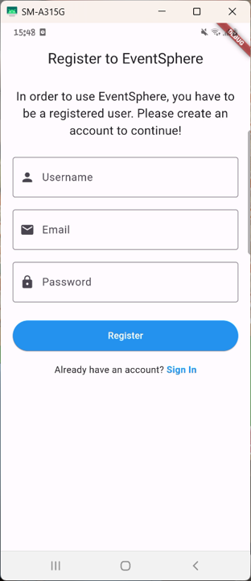
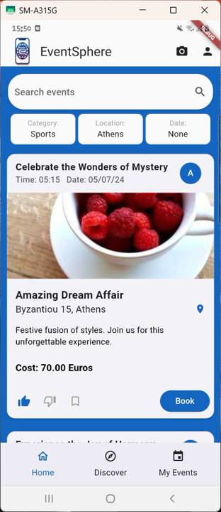
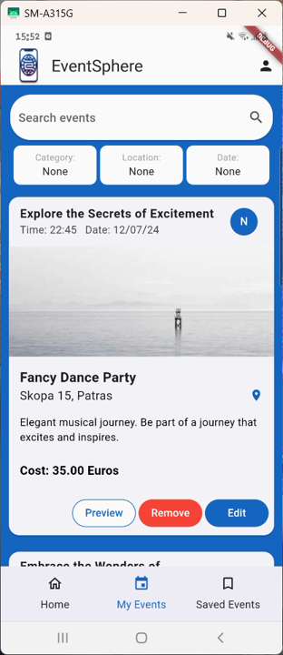
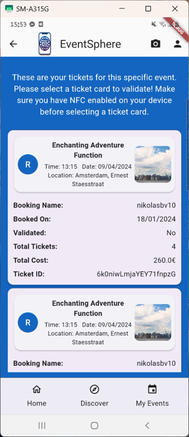

# EventSphere

## Project Overview

EventSphere is a mobile application created using Flutter and Dart, focusing on event creation and discovery while leveraging various phone capabilities such as WiFi, GPS, haptics, and camera to provide an enriched user experience. With Firebase as its backbone for database operations, EventSphere stands out in managing and participating in events. This project was developed as part of the Human and Computer Interaction course at ECE NTUA, aimed at showcasing our ability to design and implement a mobile application.

## Contributors

This project is the result of collaborative efforts by a team of aspiring software engineers:

- Antonios Alexiadis el20167@mail.ntua.gr
- Nikolaos Bothos Vouterakos el20158@mail.ntua.gr
- Charidimos Papadakis el20022@mail.ntua.gr

## Description

EventSphere is a multifaceted mobile application designed to bridge the gap between event organizers and attendees. Whether you're looking to create your own event or discover new ones to attend, EventSphere offers intuitive interfaces and smart features to cater to all your event-related needs. There are two different modes based on whether the user wants to attend or create an event:

### User Mode

In User Mode, EventSphere presents a personalized homepage featuring a curated list of events, intelligently organized based on the user’s preferences through a sophisticated machine learning algorithm. Users are greeted with events that align closely with their interests, ensuring a tailored browsing experience.

The Discover page leverages the phone's location services to showcase events in the vicinity, enabling users to find local happenings on-the-go. This geo-centric approach ensures that no matter where the user is, they can always find events nearby.

My Events is a dedicated section for users to keep track of the events they have signed up for, providing a quick glance at their upcoming activities. This helps users manage their event schedules efficiently.

Bookmarked Events feature allows users to save and monitor events they are interested in. Whether they are not yet ready to book or are simply keeping options open for the future, this feature ensures that no event falls off their radar.

Moreover, EventSphere keeps users engaged and informed with timely notifications. Users receive alerts an hour before their booked events commence, as well as personalized recommendations for events they might be interested in. This proactive approach keeps the users connected and informed, enhancing their event experience.

Additionally, the app integrates a camera feature within User Mode that allows attendees to scan a QR code, providing immediate access to the details of the event that the QR code represents. This seamless integration of camera technology ensures that users can quickly navigate to specific events with ease.

### Creator Mode

In Creator Mode, EventSphere empowers users with the tools to create and manage their events. Users can choose to publish their events, making them visible to other users in User Mode, or save them as drafts, which remain private to the creator until they're ready to go live.

The My Events page is the hub for all published events, where creators can edit details and preview their events. Similarly, the Saved Events page houses all events currently in draft form, allowing for further refinement and preparation before publication.

EventSphere further revolutionizes event management with its NFC ticket validation feature. By bringing two phones together – one in User Mode holding the ticket, and another in Creator Mode on the validation page – tickets can be validated swiftly, provided the phone supports Host Card Emulation (HCE). This advanced feature, although limited by hardware compatibility, offers a glimpse into the future of event ticketing and security.

## Features

- Create and search for events effortlessly.
- Utilize phone's capabilities: WiFi, GPS, Haptics, and Camera.
- Firebase integration for robust data handling.
- Incorporates QR code generation and scanning.
- NFC support for event interactions.
- Geolocation features for event location services.

## Getting Started

These instructions will get you a copy of the project up and running on your local machine for development and testing purposes.

## Prerequisites

Before you begin, ensure you have met the following requirements:

- **Operating System:** A compatible operating system such as Windows, macOS, or Linux.
- **Git:** Git for version control. If you don't have Git installed, download and install it from [git-scm.com](https://git-scm.com/).
- **Flutter:** The latest version of Flutter SDK for developing cross-platform applications. Follow the Flutter installation instructions on the [Flutter official website](https://flutter.dev/docs/get-started/install).
- **Android SDK:** The Android SDK is required for Android application development and comes bundled with Android Studio. Download and install Android Studio from the [Android Developer website](https://developer.android.com/studio). During installation, make sure the Android SDK and related tools are selected.
- **Java Development Kit (JDK):** The JDK is necessary for Android development. It is recommended to use the version bundled with Android Studio, but you can also install it separately from [Oracle's website](https://www.oracle.com/java/technologies/javase-jdk11-downloads.html) or use an open-source alternative like OpenJDK.
- **Emulator or Android Device:** For running and testing your application, you need either an Android emulator or a physical Android device. You can set up emulators via Android Studio's AVD Manager. If you're using a physical device, ensure USB debugging is enabled under Developer Options.
- **Android Studio (Recommended):** While not strictly necessary if you're comfortable with command-line tools, Android Studio provides a full-featured IDE with integrated emulators, debugging, and performance tools for Android development. It can be downloaded from the [Android Developer website](https://developer.android.com/studio).

For detailed setup and installation instructions, refer to the documentation provided in the links above.

## Installation

Clone the repository to your local machine:

```bash
git clone https://github.com/nikolasbv/EventSphere.git
```

Navigate to the project directory:

```bash
cd EventSphere
```

Install the required Flutter packages specified in `pubspec.yaml`:

```bash
flutter pub get
```

## Running the Application

To run the application on a connected device or emulator:

1. Ensure you have a device connected to your development machine or an emulator running.

2. Execute the following command in the terminal within your project directory:

```bash
flutter run
```

## Dependencies

List of major dependencies used in the project:

- `cupertino_icons`: For iOS-style icons.
- `firebase_core`, `firebase_auth`, `cloud_firestore`: For Firebase integration.
- `intl`: For internationalization.
- `qr_flutter`, `qr_code_scanner`: For QR code generation and scanning.
- `url_launcher`: To open web links.
- `nfc_manager`: For NFC features.
- `geolocator`, `geocoding`: For location services.
- `flutter_local_notifications`: For local notifications.
- `firebase_messaging`: For Firebase cloud messaging.
- `flutter_timezone`: For timezone calculations.
- `dart_geohash`: For geolocation encoding.

Make sure all dependencies are correctly installed as per the `pubspec.yaml` file to avoid any issues during compilation and execution.


## Data Generator and Machine Learning Algorithm

EventSphere includes a data generator and a machine learning (ML) algorithm which are key components of the application's functionality. These components use Firebase to manage and process data.

### Important Note on Firebase Integration
While the main application operates with our established Firebase instance, the data generator and ML algorithm require separate Firebase configuration if used independently or for development purposes. We strongly advise not to use our Firebase instance tokens or credentials, as they contain sensitive and private information.

### Environment Variable Setup
Before running the Data Generator and Machine Learning Algorithm, you need to set up an environment variable pointing to your Firebase Admin SDK JSON file. This ensures your code can authenticate with Firebase without hardcoding your credentials.

For Unix-based systems, set the environment variable like this:

```bash
export YOUR_FIREBASE_ADMINSDK_JSON='/path/to/your/firebase-adminsdk.json'
```

For Windows, set the environment variable via:

```cmd
set YOUR_FIREBASE_ADMINSDK_JSON=C:\path\to\your\firebase-adminsdk.json
```

### Firebase Setup
To use the data generator and ML algorithm with your own Firebase project, follow these steps:

1. Create your own Firebase project in the Firebase Console.
2. Obtain the necessary configuration files and tokens for your Firebase project.
3. Replace the placeholder in the code with your Firebase project's credentials.

For the Machine Learning Algorithm and the Data Generator, set up the environment variable for the Firebase Admin SDK JSON file path as follows:

```python
# Replace 'YOUR_FIREBASE_ADMINSDK_JSON' with the environment variable you set that points to your Firebase Admin SDK JSON file.
firebase_adminsdk_json_path = os.environ.get('YOUR_FIREBASE_ADMINSDK_JSON')

if not firebase_admin._apps:
    cred = credentials.Certificate(firebase_adminsdk_json_path)
    firebase_admin.initialize_app(cred)
```

### Data Generator Usage
To run the Data Generator, follow these steps after setting up your Firebase project and environment variable:

1. Ensure your Firebase credentials are set as described above.
2. Navigate to the directory containing dummy_data_generator.py.
3. Run the script by executing:

```bash
python dummy_data_generator.py
```

This script will interact with your Firebase database to generate and populate it with data necessary for the application to function correctly.

### Machine Learning Algorithm Usage
Similarly, to use the Machine Learning Algorithm:

1. Ensure your Firebase credentials are set as described above.
2. Navigate to the directory containing machine_learning_algorithm.py.
3. Execute the script:

```bash
python machine_learning_algorithm.py
```

This script will use data from your Firebase database to train the machine learning model, which enhances the application's event recommendation system.

---

## Screenshots of EventSphere

<p float="left">
   
  
   
   
</p>

---